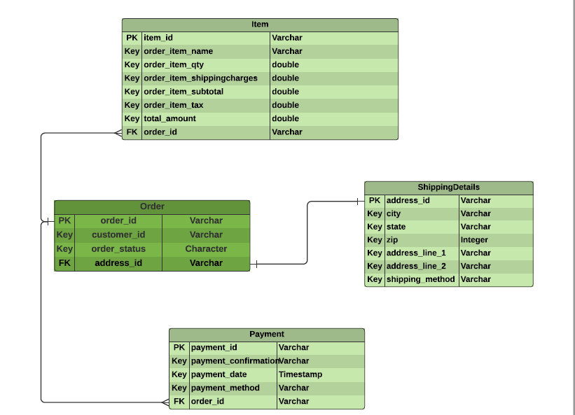

# Ecommerce order Service

## Description

In this project, I've mainly focused on Order service for an E-commerce application assuming other services like Payment, Shipping, Inventory are taken care of by other developers.

Technologies Used :
- Spring Boot
- PostgreSQL
- Spring Data JPA for ORM
- PostMan for API testing
- Swagger 2 for API documentation
- Lombok for generating Getters, Setters and Constructors 
- Mockito for Integration Testing
- Maven as Build tool
- Lombok SLF4J for logging 
- Docker to containerize the application.

I've attached a few screenshots in "images" folder in this repository for reference
## EntityRelation Diagram

ER Diagram shows all the models we used and how they are mapped into the database. 
- Pk specifies Primary keys
- Fk specifies Foreign Keys

## System Architecture

The figure gives us an overview of how multiple layers within a service interact and how our order service can interact with other Microservices

## Contact Info

- Linkedin - [Pavan S](https://www.linkedin.com/in/pavanseri/)
- Email - [Pavan S](seripavan7@gmail.com)

